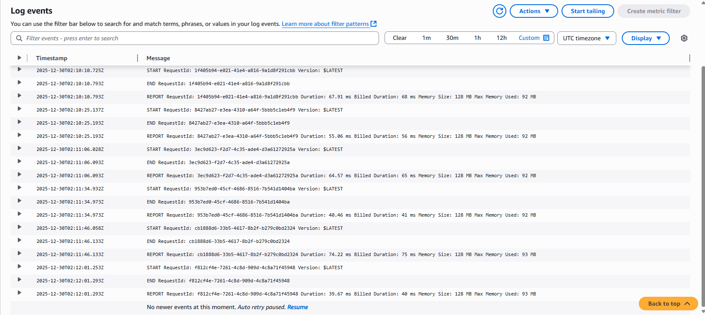

# Project 01 — Serverless API

## Overview

This project implements a stateless HTTP API using fully managed AWS services.
The system is designed to minimize operational overhead while maintaining predictable scaling, clear security boundaries, and simple persistence.

The architecture favors serverless components to eliminate idle infrastructure and reduce operational complexity.

---

## Architecture

Client → API Gateway → Lambda → DynamoDB

API Gateway serves as the public entry point.  
Lambda functions process requests and interact with DynamoDB for data persistence.

---

## Key Design Decisions

### Serverless compute
- No server management or capacity planning
- Automatic scaling based on request volume
- Cost incurred only when requests are processed

### API Gateway (HTTP API)
- Lightweight request routing
- Native integration with Lambda
- Built-in metrics and logging

### DynamoDB for persistence
- Key-value data model aligned with access patterns
- Predictable performance at scale
- No schema or capacity management

---

## API Surface

The API exposes a minimal REST interface for managing task resources.

