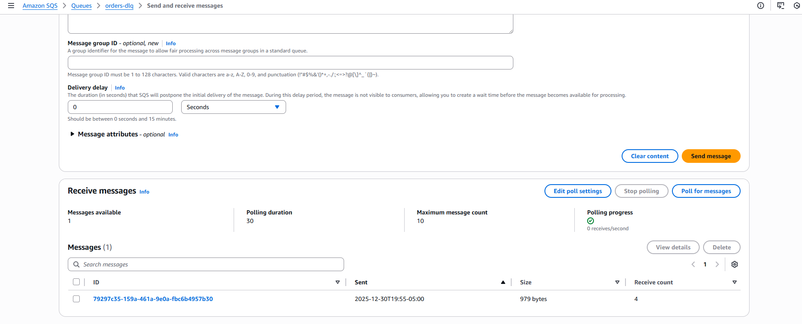

# Event-Driven Architecture (SNS + SQS + Lambda)

## What this project demonstrates
This project demonstrates an event-driven architecture using AWS managed services
to decouple producers and consumers while ensuring reliability and failure handling.

Key concepts:
- Event fanout with SNS
- Message buffering and retries with SQS
- Serverless event processing with Lambda
- Dead Letter Queue (DLQ) for failure isolation

## Architecture Diagram

## Architecture Overview
Producer → SNS Topic → SQS Queue → Lambda  
Failures are routed to an SQS Dead Letter Queue (DLQ).

## Why this design
- SNS allows one event to be delivered to multiple consumers.
- SQS decouples producers from consumers and absorbs traffic spikes.
- Lambda scales automatically based on queue depth.
- DLQ prevents poison-pill messages from blocking processing.

## Message Flow
1. An event is published to the SNS topic.
2. SNS delivers the event to the SQS queue.
3. Lambda polls the queue and processes messages.
4. If processing fails repeatedly, the message is moved to the DLQ.

## Failure Handling
Messages are retried up to 3 times.  
After exceeding the maximum receive count, messages are moved to the DLQ.

## Operational Visibility
- Lambda execution and errors are logged to CloudWatch Logs.
- DLQ messages can be inspected and reprocessed if needed.

## Teardown
All resources were deleted after validation to avoid unnecessary cost.
