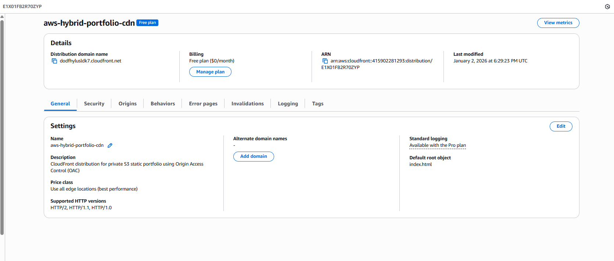
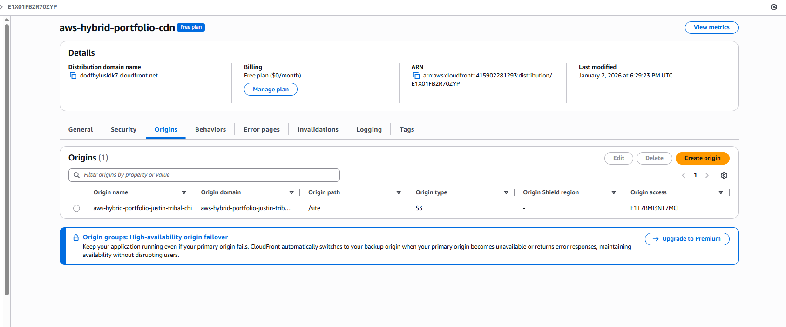
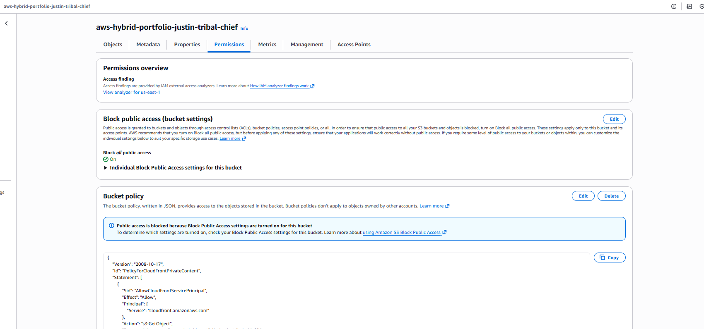
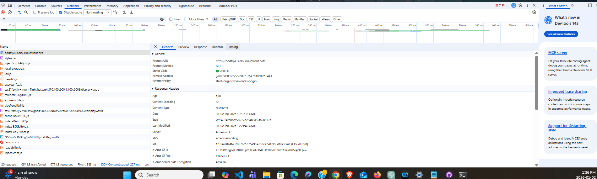

# Project 03 — Secure Static Site Delivery with CloudFront

## Overview

This project delivers a static website globally using Amazon CloudFront in front of a private Amazon S3 origin secured with Origin Access Control (OAC).

The objective is to provide fast, reliable content delivery while ensuring the origin is never publicly accessible and operational overhead remains minimal.

---

## Architecture

Client → CloudFront → Private S3 (Origin Access Control)

CloudFront serves as the only public entry point.
The S3 bucket is fully private and can only be accessed by CloudFront using a service-to-service trust relationship.

---

## Origin Protection

The S3 bucket is not publicly accessible.
Access is granted exclusively to the CloudFront distribution via Origin Access Control.

This configuration enforces CloudFront as the single ingress point and prevents direct object access.

---

## Caching and Delivery

Static assets are cached at CloudFront edge locations to reduce latency and minimize origin load.
Compression is enabled to reduce transfer size and improve performance.

---

## Operational Validation

Live traffic was validated using browser developer tools:

- Requests are served from a `cloudfront.net` domain
- Response headers confirm edge delivery
- Origin server is reported as Amazon S3
- Direct S3 access is denied

---

## Cost Characteristics

- CloudFront Free Plan
- Standard S3 storage
- No compute resources
- No always-on infrastructure

Costs scale only with usage.

---

## Trade-offs

**Pros**
- Global performance
- Strong origin security
- Minimal operational complexity
- Clear separation of concerns

**Cons**
- Cache invalidation introduces propagation delay
- Not suitable for dynamic or personalized content
- Advanced protections require paid tiers

---

## Use Cases

- Static websites
- Documentation portals
- Public portfolios
- Read-heavy content with minimal updates

---

## Future Improvements

Several enhancements were intentionally left out to keep the architecture simple and cost-efficient:

- Custom domain and managed TLS certificate
- Access logging and request analytics
- Web Application Firewall (WAF) for request inspection
- Asset versioning for refined cache control
- Multi-environment separation (staging and production)

---

## Status

Deployed  
CloudFront distribution serving content from a private S3 origin using Origin Access Control.
