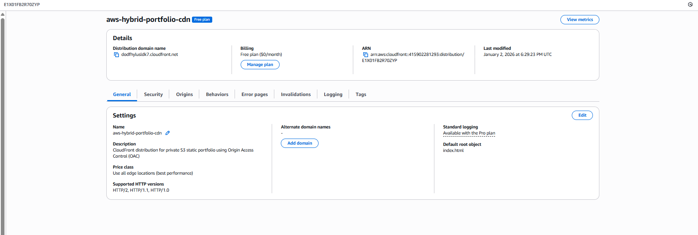
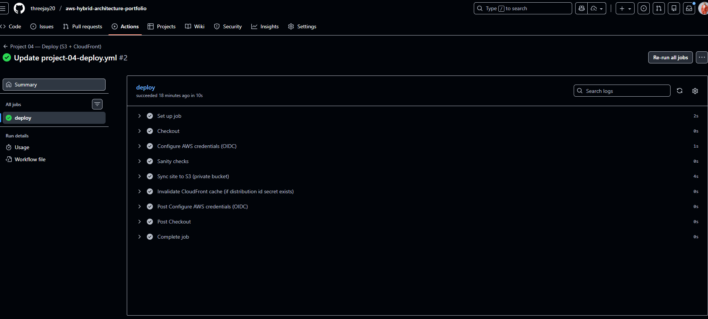

# Project 04 — CI/CD Deployment with GitHub Actions (OIDC)

## Overview

This project implements a secure CI/CD pipeline that deploys a static website to AWS using GitHub Actions with OpenID Connect (OIDC).

The pipeline authenticates to AWS without long-lived credentials, synchronizes site assets to a private S3 bucket, and serves content globally via CloudFront.

This project focuses on secure automation, least-privilege access, and production-ready deployment patterns.

---

## Architecture

GitHub Actions → AWS OIDC → IAM Role → S3 (private) → CloudFront (OAC)

GitHub Actions assumes an IAM role using OIDC.  
Static assets are uploaded to a private S3 bucket.  
CloudFront serves content using Origin Access Control (OAC).

---

## CI/CD Workflow

The deployment pipeline performs the following steps:

- Checks out repository code
- Assumes AWS IAM role using OIDC
- Runs sanity checks on site contents
- Syncs site files to a private S3 bucket
- Invalidates CloudFront cache when configured

---

## Security

Security is enforced at multiple layers:

- No AWS access keys stored in GitHub
- Authentication via OpenID Connect (OIDC)
- IAM role scoped to required S3 and CloudFront actions only
- S3 bucket is private with **Block Public Access enabled**
- CloudFront uses Origin Access Control (OAC) to access S3

---

## Infrastructure Notes

An `iac/` directory is included to demonstrate how this deployment could be fully provisioned using infrastructure-as-code.

In this implementation, AWS resources were created manually to emphasize architecture clarity and security configuration.

---

## Operational Characteristics

- Fully automated deployments on push
- No manual AWS console interaction required
- Fast rollback by redeploying previous commits
- CloudFront invalidation handled automatically

---

## Cost Considerations

- S3 static hosting costs are minimal
- CloudFront uses AWS free tier where applicable
- GitHub Actions uses included minutes

No persistent compute resources are running.

---

## Status

Deployment pipeline is active and verified.  
Static site is successfully served via CloudFront using a private S3 origin.

